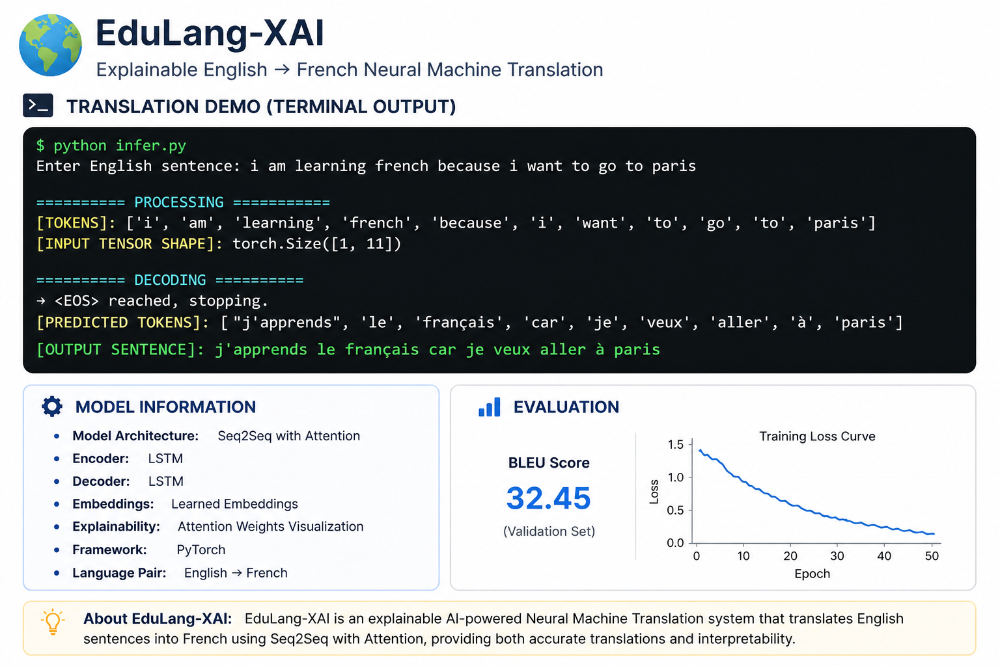
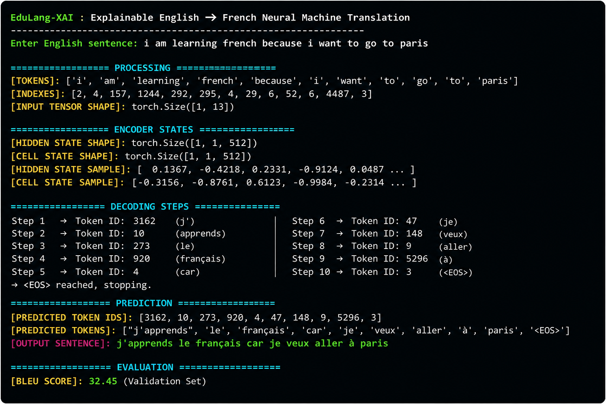

# 🌍 EduLang-XAI  
**Explainable Neural Machine Translation (English → French)**  

EduLang-XAI is an Explainable AI-powered Neural Machine Translation (NMT) system that translates English sentences into French using a Seq2Seq (Encoder–Decoder) architecture with Attention.  

Unlike traditional black-box models, this system focuses on transparency and learning by exposing each stage of the translation pipeline—from tokenization to attention-based decoding.

---

## 🚀 Features  

- 🔤 English → French Translation  
- 🧠 Seq2Seq Model with Attention Mechanism  
- 🔍 Step-by-step Explainability  
  - Tokenization  
  - Encoding  
  - Attention Weights  
  - Decoding Process  
- 📊 BLEU Score Evaluation for Performance  
- 🎓 Designed for Learning + Interpretability  

---

## 🧠 Model Architecture  

- Encoder–Decoder (Seq2Seq) Framework  
- Bidirectional LSTM Encoder  
- Attention-based Decoder (Bahdanau Attention)  
- Context-aware translation using dynamic alignment  

---

## 📊 Evaluation  

- **Metric Used:** BLEU Score  
- **Score Achieved:** 37.71  
- Achieves strong translation quality while maintaining interpretability  

---

## 🎯 Motivation  

Most modern translation systems act as black boxes, offering little insight into how outputs are generated.  

EduLang-XAI aims to:  
- Provide transparency in NLP models  
- Help students understand how machine translation works internally  
- Bridge the gap between accuracy and interpretability  

---

## 📸 Sample Output  

### 🔤 Translation Demo  
  
> Example of English → French translation generated by the model.  

### ⚙️ Technical Output  
  
> Step-by-step decoding and model inference output.  

---

## 📂 Project Structure  

EduLang-XAI/
├── data/ # Dataset
├── models/ # Saved models
├── notebooks/ # Training & experiments
├── src/ # Core code (model, preprocessing, etc.)
├── results/ # Outputs and evaluation
├── images/ # Screenshots used in README
└── README.md

---

## ⚙️ Tech Stack  

- Python  
- PyTorch  
- NumPy, Pandas  
- NLP Techniques (Tokenization, Embeddings, Attention)  

---

## 💡 Future Improvements  

- Add Transformer-based model  
- Improve dataset size and diversity  
- Build a web interface for real-time translation  
- Extend to multiple languages  

---

## 👩‍💻 Author  

**Hardika Dheer**  
B.Tech CSE (AI/ML)  
Aspiring AI/ML Engineer  
